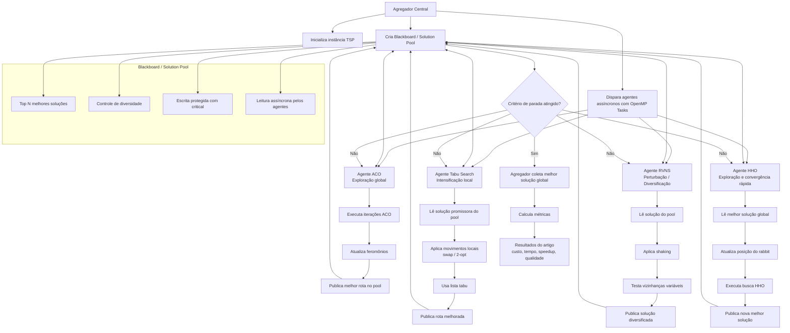

# Arquitetura Detalhada do Sistema Multi-Agentes (TSP)

Este documento descreve a arquitetura lógica, de dados e concorrente do sistema cooperativo para a resolução do Problema do Caixeiro Viajante (TSP) usando a biblioteca **hscopt** e **OpenMP**.

---

## 1. Diagrama Geral de Arquitetura

O fluxo abaixo ilustra as interações assíncronas entre os agentes de busca e o componente central de memória compartilhada (Blackboard):



---

## 2. Componente Central: Blackboard / Solution Pool

O Blackboard atua como o mediador estocástico e repositório comum de conhecimento do sistema. Ele impede o acoplamento direto entre as threads dos agentes, mantendo a comunicação 100% assíncrona.

### Atributos Lógicos da Pool:
| Atributo | Tipo | Descrição |
| :--- | :--- | :--- |
| `pool` | Vetor de `Solution` | Armazena o Top $N$ ($N=5$) melhores chaves e seus custos (fitness). |
| `count` | Inteiro | Número de soluções atualmente mantidas no pool. |
| `lock` | `omp_lock_t` | Primitiva de sincronização concorrente do OpenMP. |

### Regras de Negócio do Blackboard:
1. **Escrita Protegida**: Operações de inclusão e ordenação são isoladas por lock físico para prevenir corrupção da memória (data races) em cenários de alta concorrência.
2. **Filtro de Diversidade**: É calculado o desvio absoluto entre a rota candidata e as rotas já armazenadas na pool. Se a diferença for menor do que $10^{-3}$, a nova solução é sumariamente descartada, preservando a variabilidade populacional.
3. **Leitura Livre e Estocástica**: Agentes podem ler chaves do pool sem impactar outros agentes. A seleção pode ser **determinística** (coletar a melhor absoluta para refinar) ou **probabilística** (coletar uma rota aleatória para chacoalhar).

---

## 3. Os Agentes de Otimização e Seus Perfis Lógicos

Para obter um solucionador híbrido de alto desempenho, os quatro algoritmos da `hscopt` são instanciados e configurados para cobrir o espectro entre **Exploração** (mapeamento de novas regiões) e **Explotação** (intensificação local):

```
[Área de Busca Global]
       │
       ├─► ACO (Exploração Pura): Lança "formigas" pelo espaço de chaves aleatórias.
       │
       ├─► HHO (Swarm Híbrido): Ataca a melhor área central encurralando a presa (rabbit).
       │
       ├─► RVNS (Fase de Escape): Altera dinamicamente o nível de perturbação para sair de platôs.
       │
       └─► Tabu Search (Explotação Pura): Realiza micro-ajustes finos no vetor de chaves.
```

### Matriz de Perfis dos Agentes:
| Agente | Tipo Computacional | Foco Principal | Estratégia de Cooperação |
| :--- | :--- | :--- | :--- |
| **ACO** | Algoritmo Populacional | Exploração Global | Compartilha feromônios injetando rotas do pool em seu histórico. |
| **Tabu Search** | Trajetória / Busca Local | Intensificação Local | Reseta sua busca incumbente usando a melhor rota atual da pool. |
| **RVNS** | Trajetória / Perturbação | Diversificação | Altera chaves obtidas de forma aleatória do pool usando 3 níveis de shaking. |
| **HHO** | Inteligência de Enxame | Convergência Rápida | Move todos os hawks em direção ao rabbit (melhor rota lida da pool). |

---

## 4. O Fluxo de Dados: Random Keys e Arg-Sort

A arquitetura usa o mapeamento matemático de chaves aleatórias no hipercubo $[0, 1)^N$ para representar permutações discretas do TSP:

```
[Vetor de Chaves Aleatórias (Keys)]
  Double: [ 0.85,  0.15,  0.42,  0.91,  0.03 ]
             │      │      │      │      │
[Processamento de Ordenamento (Arg-Sort)]
  Ordenado: 0.03 < 0.15 < 0.42 < 0.85 < 0.91
  Índices:   [4]    [1]    [2]    [0]    [3]
             │      │      │      │      │
[Permutação de Cidades no TSP (Tour)]
  Rota:     4  ──►  1  ──►  2  ──►  0  ──►  3  ──► (Retorna a 4)
```

### Vantagens dessa Abordagem:
* **Espaço de Busca Contínuo**: Permite que algoritmos contínuos (como o HHO) resolvam um problema estritamente discreto (TSP) sem a necessidade de operadores de cruzamento ou mutação complexos.
* **Isolamento de Memória**: O decoder não realiza alterações no vetor de chaves original. Ele lê o hipercubo e calcula o custo de forma determinística e isolada, garantindo total conformidade com a concorrência assíncrona do OpenMP.
