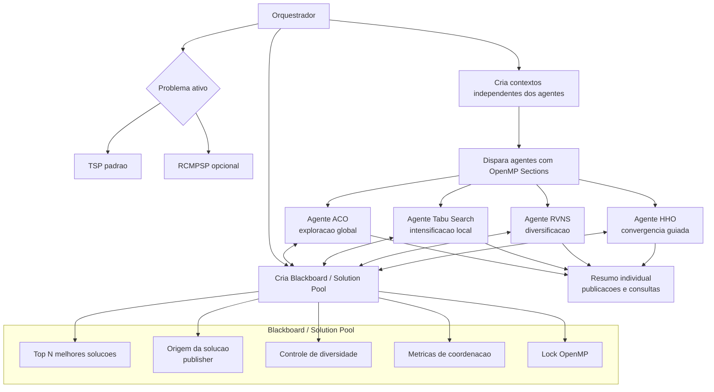
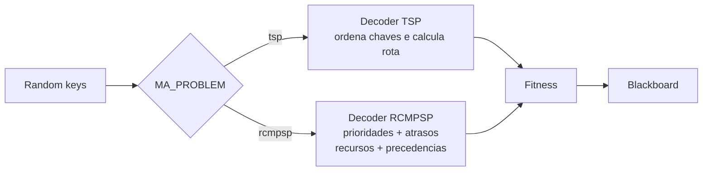

# Arquitetura Detalhada do Sistema Multi-Agentes

Este documento descreve a arquitetura lógica, de dados e concorrente do sistema cooperativo para resolver problemas combinatórios com decoders alternáveis, atualmente **TSP** e **RCMPSP**, usando a biblioteca **hscopt** e **OpenMP**.

---

## 1. Diagrama Geral de Arquitetura

O fluxo abaixo ilustra as interações assíncronas entre os agentes de busca e o componente central de memória compartilhada (Blackboard):

---

## 2. Componente Central: Blackboard / Solution Pool

O Blackboard atua como o mediador estocástico e repositório comum de conhecimento do sistema. Ele impede o acoplamento direto entre as threads dos agentes, mantendo a comunicação assíncrona.

### Atributos Lógicos da Pool

| Atributo | Tipo | Descrição |
| :--- | :--- | :--- |
| `pool` | Vetor de `solution` | Armazena as melhores chaves e seus custos. |
| `count` | Inteiro | Número de soluções atualmente mantidas no pool. |
| `publisher` | Texto | Registra qual agente originou cada solução. |
| `total_publications` | Inteiro | Total de publicações aceitas. |
| `total_consultations` | Inteiro | Total de consultas ao Blackboard. |
| `shared_solution_reads` | Inteiro | Consultas que retornaram soluções compartilhadas. |
| `lock` | `omp_lock_t` | Primitiva de sincronização concorrente do OpenMP. |

### Regras de Negócio do Blackboard

1. **Escrita protegida**: operações de inclusão e ordenação são protegidas por lock.
2. **Filtro de diversidade**: soluções com fitness praticamente igual são descartadas.
3. **Leitura autônoma**: agentes decidem quando consultar a pool.
4. **Rastreabilidade**: cada solução final guarda a origem e a execução imprime métricas por agente.

---

## 3. Os Agentes de Otimização e Seus Perfis Lógicos

| Agente | Tipo Computacional | Foco Principal | Estratégia de Cooperação |
| :--- | :--- | :--- | :--- |
| **ACO** | Populacional | Exploração global | Injeta soluções compartilhadas em sua busca. |
| **Tabu Search** | Busca local | Intensificação | Reinicia a busca a partir de solução promissora da pool. |
| **RVNS** | Vizinhanças variáveis | Diversificação | Perturba soluções lidas da pool. |
| **HHO** | Enxame | Convergência | Usa a melhor solução compartilhada como referência. |

---

## 4. Decoders Alternáveis

O sistema separa a parte independente do problema (agentes, blackboard e orquestração) da parte dependente do problema (instância, workspace e decoder).

O TSP é o padrão. O RCMPSP pode ser selecionado com `-DMA_PROBLEM=rcmpsp` ou com `mise run run:rcmpsp`.
