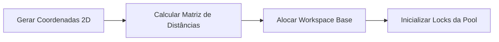
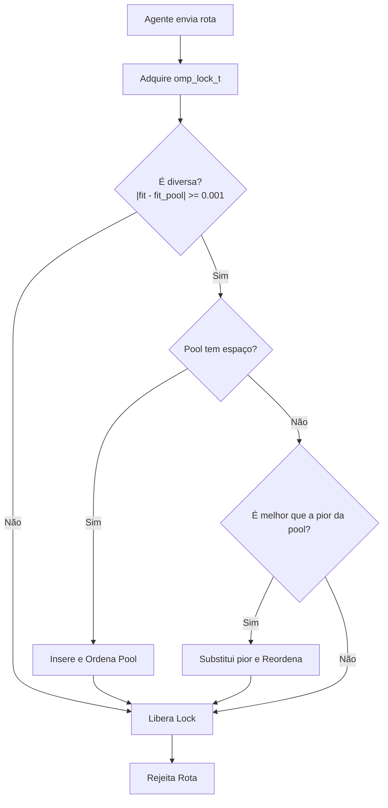

# Funcionamento do Processo Multi-Agentes (TSP)

Este documento detalha o fluxo operacional do algoritmo multi-agentes assíncrono projetado para resolver o Problema do Caixeiro Viajante (TSP) usando a biblioteca **hscopt** com paralelismo **OpenMP**.

---

## 1. Fase de Inicialização e Preparação

Antes do disparo dos agentes paralelos, o sistema realiza a montagem de todo o ambiente de computação.



### Detalhes das Etapas:
1. **Instanciação do Problema (TSPInstance)**: São geradas coordenadas 2D aleatórias para as $N$ cidades do problema (neste caso, 50 cidades). A partir delas, a matriz de distâncias euclidianas simétricas é pré-calculada, servindo como o objeto de dados imutável acessado por todos os threads.
2. **Workspace Base (`ws_base`) e Contexto de Decodificação**: A `hscopt` necessita de um decoder thread-safe. Para evitar alocações constantes de memória dentro do laço de execução rápida (*hot loop*), instanciamos uma estrutura `TSPWorkspace` base. Definimos a função de clonagem `tsp_ws_clone` e destruição `tsp_ws_destroy`, permitindo que cada thread aloque seus vetores temporários para ordenamento uma única vez na inicialização de sua execução paralela.
3. **Instanciação do Blackboard/Solution Pool**: A estrutura do Blackboard é criada e seu lock de concorrência (`omp_lock_t`) é inicializado. A pool é inicialmente marcada como vazia.

---

## 2. Fase de Disparo e Paralelismo Assíncrono

Utilizando a diretiva `#pragma omp parallel sections`, o OpenMP cria e gerencia 4 seções paralelas rodando de forma assíncrona em núcleos diferentes de CPU. Cada seção é ocupada por um agente específico de otimização:

```
[Núcleo 0] ──> Agente ACO (Exploração Global)           ──────┐
[Núcleo 1] ──> Agente Tabu Search (Intensificação Local) ─────┼──> [Blackboard/Pool Compartilhado]
[Núcleo 2] ──> Agente RVNS (Perturbação Dinâmica)         ────┼──> (Escrita e Leitura Sincronizadas)
[Núcleo 3] ──> Agente HHO (Convergência Rápida)          ─────┘
```

> [!IMPORTANT]
> **Independência Estocástica (`hscopt_rng_jump`)**
> Cada agente inicializa seu próprio gerador pseudoaleatório (`hscopt_rng`). Para evitar que os geradores das threads caminhem na mesma trajetória matemática, aplicamos a função de salto da biblioteca:
> * Agente 1 (ACO): 1 Salto (`hscopt_rng_jump`)
> * Agente 2 (TS): 2 Saltos
> * Agente 3 (RVNS): 3 Saltos
> * Agente 4 (HHO): 4 Saltos
> Isso garante subsequências aleatórias estatisticamente disjuntas.

---

## 3. Dinâmica Interna dos Agentes

Cada agente possui um papel metabólico específico no ecossistema de otimização:

### 🐜 Agente 1: Ant Colony Optimization (ACO)
* **Objetivo**: Varredura global e mapeamento de boas topologias de rotas.
* **Operação**: Modela a atração das formigas com base em chaves aleatórias e atualiza os feromônios do arquivo de soluções (`archive_size = 20`).
* **Cooperação**: A cada iteração, ele publica sua melhor rota no Blackboard e lê uma solução aleatória da pool. Ele tenta injetar essa solução visitante no seu próprio arquivo do ACO, garantindo que boas ideias dos outros agentes influenciem seu feromônio.

### 🔍 Agente 2: Tabu Search (TS)
* **Objetivo**: Explotação profunda e refinamento em nível de bairro.
* **Operação**: Aplica perturbações do tipo *1-flip* (alterar o valor de uma única random key) avaliando vizinhos. Ele mantém uma lista tabu de índices modificados recentemente para evitar ciclos e escapar de ótimos locais.
* **Cooperação**: Em intervalos regulares, o TS lê a **melhor rota absoluta** presente no Blackboard, reinicia sua busca local a partir dela (`hscopt_ts_reset`), e refina essa solução ao máximo, tentando produzir melhorias de alta qualidade para devolver ao pool.

### 🌀 Agente 3: Reduced Variable Neighborhood Search (RVNS)
* **Objetivo**: Perturbação e diversificação do espaço de busca.
* **Operação**: Implementa uma estrutura de $k\_max=3$ vizinhanças dinâmicas. Ele aplica uma chacoalhada (*shaking*) nas chaves aleatórias variando o nível de perturbação proporcionalmente a $k$.
* **Cooperação**: Para evitar que a busca caia em estagnação, o RVNS lê uma solução aleatória do pool, reseta seu estado incumbente com ela, aplica perturbações estocásticas variadas e joga a nova versão chacoalhada de volta no pool.

### 🦅 Agente 4: Harris Hawks Optimization (HHO)
* **Objetivo**: Convergência matemática ágil.
* **Operação**: Simula o comportamento cooperativo de caça dos gaviões-de-harris. O grupo rastreia a presa (chamada de *rabbit*), reduzindo sua energia de fuga com base nas iterações globais.
* **Cooperação**: O HHO lê periodicamente a melhor rota absoluta encontrada pelo sistema no Blackboard e atualiza a posição do *rabbit*. Os hawks passam então a convergir em torno deste novo melhor ponto central conhecido.

---

## 4. O Protocolo de Comunicação e a Pool de Soluções (Blackboard)

O Blackboard funciona como a memória operacional compartilhada do sistema e gerencia a aceitação de novas rotas de acordo com a lógica abaixo:



### Regras de Ouro do Blackboard:
* **Escrita Segura**: O Blackboard protege sua integridade usando primitivas de exclusão mútua (`omp_set_lock` e `omp_unset_lock`). Apenas um agente modifica a memória da pool por vez.
* **Preservação de Diversidade**: Duas soluções com custo (fitness) extremamente idêntico ($< 0.001$ de diferença) são rejeitadas. Isso impede que os agentes fiquem trocando rotas com estruturas redundantes, garantindo que o pool de soluções armazene alternativas geograficamente distintas de tours.

---

## 5. Critério de Parada e Coleta de Métricas

Quando o agente HHO atinge o número máximo de iterações configurado (`max_global_iterations`), a variável global `stop_criterion_met` é definida como `1`.

1. Todos os agentes detectam a sinalização na próxima verificação de laço e encerram suas atividades de forma limpa, destruindo seus respectivos contextos da `hscopt`.
2. O thread principal (mestre) retoma o controle sequencial do programa.
3. O Blackboard é consultado para extrair:
   * A melhor rota absoluta (Rank 1).
   * A qualidade das demais rotas na pool.
   * O tempo computacional de execução paralela obtido com `omp_get_wtime()`.
