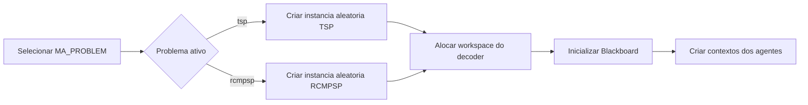
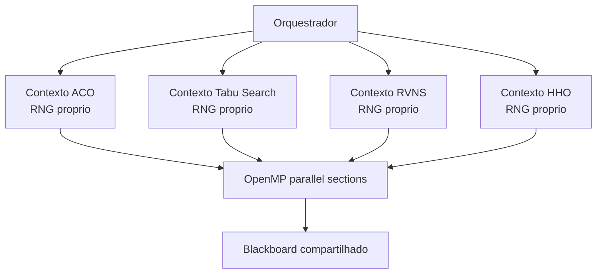
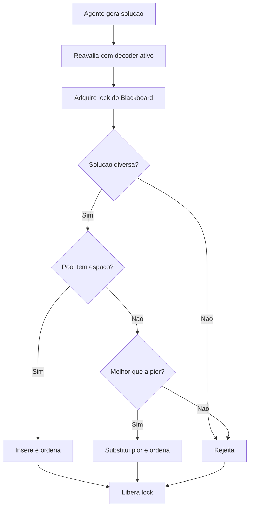

# Funcionamento do Processo Multi-Agentes

Este documento detalha o fluxo operacional do sistema multi-agentes assíncrono usando a biblioteca **hscopt** com paralelismo **OpenMP**.

---

## 1. Fase de Inicialização e Preparação

Antes do disparo dos agentes paralelos, o sistema monta o ambiente de computação.

### Detalhes das Etapas

1. **Seleção do problema**: `MA_PROBLEM=tsp` é o padrão; `MA_PROBLEM=rcmpsp` ativa o decoder de escalonamento multi-projeto.
2. **Instância aleatória**: cada problema possui uma função própria para criar uma instância aleatória.
3. **Workspace do decoder**: cada decoder fornece funções de criação, clonagem e destruição de workspace.
4. **Blackboard**: a pool compartilhada é inicializada antes dos agentes.

---

## 2. Fase de Disparo e Paralelismo Assíncrono

Os agentes são executados em seções OpenMP independentes.

Cada agente possui:

- nome e papel;
- gerador pseudoaleatório próprio;
- workspace local para reavaliar soluções;
- contadores de publicações, consultas e leituras compartilhadas.

---

## 3. Protocolo de Comunicação

O Blackboard gerencia a aceitação e o compartilhamento de soluções.

---

## 4. Critério de Parada e Métricas

Ao final da execução, o sistema imprime:

- melhor solução e custo validado;
- origem de cada solução mantida na pool;
- publicações aceitas;
- consultas ao Blackboard;
- leituras de soluções compartilhadas;
- resumo individual de cada agente.
